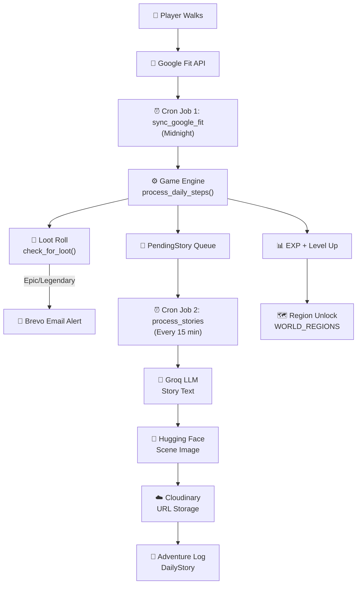

# 🗡️ Isekai Tracker — Technical Architecture

---

## Overview

Pokémon GO proved that gamifying walking works — millions of people moved more because every few hundred steps could spawn a Pokémon nearby. But it has a fundamental flaw: it requires you to **look at your phone while walking**. Spawning happens in real-time, on the road, and that's inherently unsafe. People have walked into traffic, tripped on stairs, and caused accidents because the gamification demanded attention at the wrong moment.

**Isekai Tracker** solves this by decoupling the gamification from the act of walking entirely. Instead of real-time spawning on a map, the app tracks your **total daily steps** through Google Fit. At the end of each day, a background cron job processes your steps and converts them into an **RPG adventure** — complete with AI-generated stories, illustrated scenes, loot drops, enemy encounters, and level progression.

You never need to look at your phone while walking. You just **walk**. The next day, you come back to read the new chapter of **your own personal Isekai light novel**.

---

## Game Engine

### Step Syncing — Google Fit Integration

When a player signs up, they connect their Google Fit account with a single button click. The app uses **Google OAuth 2.0** to securely authenticate and stores the encrypted refresh token in the database — not in the session — so background cron jobs can sync steps later without the user being logged in.

| Feature                     | Implementation                                                                                                                                      |
| --------------------------- | --------------------------------------------------------------------------------------------------------------------------------------------------- |
| OAuth Flow                  | [tracker/fit_service.py → `FitService.get_flow()`](<file:///c:/Windows%20(D%20Drive)/VS%20Code/Web/Isekai_Tracker/tracker/fit_service.py#L12-L25>)  |
| Callback & Token Storage    | [tracker/views.py → `google_fit_callback()`](<file:///c:/Windows%20(D%20Drive)/VS%20Code/Web/Isekai_Tracker/tracker/views.py#L25-L46>)              |
| Fetching Steps from Fit API | [tracker/fit_service.py → `FitService.get_steps()`](<file:///c:/Windows%20(D%20Drive)/VS%20Code/Web/Isekai_Tracker/tracker/fit_service.py#L26-L73>) |
| Encrypted Token Storage     | [players/fields.py → `EncryptedTextField`](<file:///c:/Windows%20(D%20Drive)/VS%20Code/Web/Isekai_Tracker/players/fields.py#L16-L36>)               |
| Manual Sync Button          | [tracker/views.py → `sync_google_fit()`](<file:///c:/Windows%20(D%20Drive)/VS%20Code/Web/Isekai_Tracker/tracker/views.py#L74-L138>)                 |

### EXP & Leveling System

Every step is converted into EXP at a rate of **0.1 EXP per step** — so 10,000 steps yields 1,000 EXP. The leveling system uses a **polynomial scaling formula**: `BASE_XP × (Level ^ 1.3)`, meaning early levels are fast and encouraging while later levels require real commitment.

On level-up, the player's HP and Mana increase. Equipped items with EXP multipliers (e.g., a Legendary artifact granting **2× EXP**) **stack multiplicatively** across all gear slots.

At roughly **10,000 steps per day**, a player can complete all **200 levels** in approximately **23.4 years** — designed to be a lifelong companion.

| Feature                         | Implementation                                                                                                                                                       |
| ------------------------------- | -------------------------------------------------------------------------------------------------------------------------------------------------------------------- |
| EXP Calculation & Level-Up Loop | [tracker/services.py → `process_daily_steps()`](<file:///c:/Windows%20(D%20Drive)/VS%20Code/Web/Isekai_Tracker/tracker/services.py#L77-L167>)                        |
| EXP Formula Constants           | [tracker/constants.py → `EXP_PER_STEP`, `BASE_XP_REQ`, `LEVEL_EXPONENT`](<file:///c:/Windows%20(D%20Drive)/VS%20Code/Web/Isekai_Tracker/tracker/constants.py#L2-L4>) |
| Required EXP Calculator         | [tracker/services.py → `calculate_required_exp()`](<file:///c:/Windows%20(D%20Drive)/VS%20Code/Web/Isekai_Tracker/tracker/services.py#L74-L75>)                      |
| Player Profile & Stats          | [players/models.py → `PlayerProfile`](<file:///c:/Windows%20(D%20Drive)/VS%20Code/Web/Isekai_Tracker/players/models.py#L8-L57>)                                      |

### World Regions & Enemy Encounters

The virtual world is divided into **13 distinct regions** that unlock every 10–20 levels, progressing from the **Greenleaf Kingdom** (a humble village with Green Slimes and Forest Goblins) to **The Void's Edge** at level 200 (where players face _Echoes of the First God_ and _The Void Sovereign_).

Each region has its own hardcoded array of enemies. During story generation, there's a **30% chance** of a combat encounter with a random enemy from the current region, and a **70% chance** of peaceful exploration.

| Feature                                       | Implementation                                                                                                                                           |
| --------------------------------------------- | -------------------------------------------------------------------------------------------------------------------------------------------------------- |
| 13 World Regions (Forest → Lava → Ice → Void) | [tracker/constants.py → `WORLD_REGIONS`](<file:///c:/Windows%20(D%20Drive)/VS%20Code/Web/Isekai_Tracker/tracker/constants.py#L6-L25>)                    |
| Region-Specific Enemy Arrays                  | [tracker/constants.py → `REGION_ENEMIES`](<file:///c:/Windows%20(D%20Drive)/VS%20Code/Web/Isekai_Tracker/tracker/constants.py#L27-L46>)                  |
| Region Unlock on Level-Up                     | [tracker/services.py → `process_daily_steps()` L112-L116](<file:///c:/Windows%20(D%20Drive)/VS%20Code/Web/Isekai_Tracker/tracker/services.py#L111-L116>) |
| 30/70 Combat vs Exploration Roll              | [quests/generator.py → `generate_isekai_chapter()` L36-L43](<file:///c:/Windows%20(D%20Drive)/VS%20Code/Web/Isekai_Tracker/quests/generator.py#L36-L43>) |

---

## AI Story Pipeline

The core of Isekai Tracker is a **3-stage chained AI pipeline** that generates a personalized story chapter for each player every day:

### Stage 1 — Story Text (Groq / Llama 3.1 8B Instant)

A carefully crafted prompt is sent to the Groq API running **Llama 3.1 8B Instant**. The prompt includes the player's visual DNA, current gear, world region, the enemy encounter roll, and — critically — **the previous day's memory summary**. This memory chaining ensures each day's story naturally continues from where yesterday left off, creating a coherent ongoing narrative.

The AI returns three structured fields:

- **STORY**: The narrative text for the day
- **SUMMARY**: A compressed memory context for tomorrow's prompt
- **ACTION**: A phrase describing what the hero is physically doing (used for image generation)

### Stage 2 — Scene Illustration (Hugging Face / FLUX.1-schnell)

The ACTION phrase is combined with the player's visual description and world region to form an image prompt. This is sent to **FLUX.1-schnell** on the Hugging Face Inference API, which generates an anime-style illustration of the scene.

### Stage 3 — Cloud Storage Optimization (Cloudinary)

Instead of storing generated images as binary blobs in the database, they are uploaded to **Cloudinary** and only the returned **URL string** is stored. This reduces per-story storage from approximately **2 MB** (raw image) to **0.02 KB** (a URL string) — a **100,000× reduction** in database usage.

| Feature                               | Implementation                                                                                                                                    |
| ------------------------------------- | ------------------------------------------------------------------------------------------------------------------------------------------------- |
| Full Story Generation Pipeline        | [quests/generator.py → `generate_isekai_chapter()`](<file:///c:/Windows%20(D%20Drive)/VS%20Code/Web/Isekai_Tracker/quests/generator.py#L24-L157>) |
| Narrative Prompt with Memory Chaining | [quests/generator.py → L46-L65](<file:///c:/Windows%20(D%20Drive)/VS%20Code/Web/Isekai_Tracker/quests/generator.py#L46-L65>)                      |
| Groq LLM API Call                     | [quests/generator.py → L69-L88](<file:///c:/Windows%20(D%20Drive)/VS%20Code/Web/Isekai_Tracker/quests/generator.py#L69-L88>)                      |
| Regex-Based Response Parsing          | [quests/generator.py → L91-L106](<file:///c:/Windows%20(D%20Drive)/VS%20Code/Web/Isekai_Tracker/quests/generator.py#L91-L106>)                    |
| Hugging Face Image Generation         | [quests/generator.py → L108-L138](<file:///c:/Windows%20(D%20Drive)/VS%20Code/Web/Isekai_Tracker/quests/generator.py#L108-L138>)                  |
| Cloudinary Upload & URL Storage       | [quests/generator.py → L128-L134](<file:///c:/Windows%20(D%20Drive)/VS%20Code/Web/Isekai_Tracker/quests/generator.py#L128-L134>)                  |
| Story Database Model                  | [quests/models.py → `DailyStory`](<file:///c:/Windows%20(D%20Drive)/VS%20Code/Web/Isekai_Tracker/quests/models.py#L6-L24>)                        |
| Adventure Log (Story Reader UI)       | [tracker/views.py → `adventure_log()`](<file:///c:/Windows%20(D%20Drive)/VS%20Code/Web/Isekai_Tracker/tracker/views.py#L160-L177>)                |

---

## Passive Loot Drop System

### Passive Loot Drops

For every **5,000 steps** walked, the player receives one independent loot roll with the following probability table:

| Roll Result | Probability |
| ----------- | ----------- |
| No Loot     | 50.00%      |
| Common      | 26.50%      |
| Rare        | 12.75%      |
| Epic        | 6.84%       |
| Legendary   | 3.91%       |

Walking 15,000 steps triggers **3 independent rolls**. Each successful roll picks a random item from the corresponding rarity tier. Items span 4 categories — **Weapons, Armor, Artifacts, and Consumables** — with **60 unique hardcoded items** across all tiers. Each item provides stat bonuses: HP buffs, Mana buffs, or **EXP multipliers** for faster progression.

The best item in the game — the **Eye of Fate** (Legendary Artifact) — grants **100% bonus EXP**, doubling progression speed.

Players can view, equip, and swap gear from the **Inventory page**. The equip system enforces one item per slot type, and stat bonuses from equipped items are calculated dynamically via Django model properties.

| Feature                            | Implementation                                                                                                                                         |
| ---------------------------------- | ------------------------------------------------------------------------------------------------------------------------------------------------------ |
| Loot Roll Engine & Rarity Table    | [tracker/services.py → `check_for_loot()`](<file:///c:/Windows%20(D%20Drive)/VS%20Code/Web/Isekai_Tracker/tracker/services.py#L14-L72>)                |
| 60 Hardcoded Items (Loot Table)    | [players/management/commands/seed_items.py](<file:///c:/Windows%20(D%20Drive)/VS%20Code/Web/Isekai_Tracker/players/management/commands/seed_items.py>) |
| Item Model (Stats & Rarity)        | [players/models.py → `Item`](<file:///c:/Windows%20(D%20Drive)/VS%20Code/Web/Isekai_Tracker/players/models.py#L59-L77>)                                |
| Inventory Model & Equipment        | [players/models.py → `InventoryItem`](<file:///c:/Windows%20(D%20Drive)/VS%20Code/Web/Isekai_Tracker/players/models.py#L79-L87>)                       |
| Dynamic HP/Mana from Equipped Gear | [players/models.py → `hp` & `mana` properties](<file:///c:/Windows%20(D%20Drive)/VS%20Code/Web/Isekai_Tracker/players/models.py#L36-L44>)              |
| Equip/Unequip Toggle Logic         | [players/views.py → `toggle_equip()`](<file:///c:/Windows%20(D%20Drive)/VS%20Code/Web/Isekai_Tracker/players/views.py#L63-L86>)                        |
| EXP Multiplier Stacking            | [tracker/services.py → `process_daily_steps()` L87-L95](<file:///c:/Windows%20(D%20Drive)/VS%20Code/Web/Isekai_Tracker/tracker/services.py#L87-L95>)   |
| Inventory Page                     | [players/views.py → `inventory_page()`](<file:///c:/Windows%20(D%20Drive)/VS%20Code/Web/Isekai_Tracker/players/views.py#L52-L61>)                      |

---

## Email Notifications

### Epic & Legendary Loot Alerts via Brevo

When the loot roll falls below the **~7% threshold** (Epic or Legendary tier), the system automatically sends a styled email via **Brevo** (formerly Sendinblue) using their transactional email API. The email uses a **custom HTML template** with dynamic variables for the player's name, item name, and rarity tier.

This serves as a re-engagement mechanism — a player who hasn't checked the app receives an email like _"You just found the Excalibur of the Sun ⚔️ — come check your adventure!"_, pulling them back into the app.

| Feature                          | Implementation                                                                                                                                  |
| -------------------------------- | ----------------------------------------------------------------------------------------------------------------------------------------------- |
| Loot Email Trigger Logic         | [tracker/services.py → `check_for_loot()` L63-L70](<file:///c:/Windows%20(D%20Drive)/VS%20Code/Web/Isekai_Tracker/tracker/services.py#L61-L70>) |
| Brevo Transactional Email Sender | [tracker/utils.py → `send_loot_email()`](<file:///c:/Windows%20(D%20Drive)/VS%20Code/Web/Isekai_Tracker/tracker/utils.py#L5-L22>)               |

---

## Cron Job Architecture

Three automated cron jobs run on a schedule via **Cron-jobs.org**, each calling a secured HTTP endpoint on the Django app:

### Cron Job 1: `sync_google_fit` — Runs at Midnight

At midnight, this job fetches the previous day's steps from Google Fit for **all** connected players. It reconstructs OAuth credentials from encrypted tokens, refreshes expired access tokens, creates the `DailyStepLog` entry, and fires the game engine — which calculates EXP, triggers level-ups, rolls for loot, and queues story generation tasks.

Includes a **duplicate-run guard** — if the job is accidentally triggered twice (by Railway or Cron-jobs.org), it detects existing processed logs for that date and exits early to prevent double-processing.

### Cron Job 2: `process_stories` — Runs Every 15 Minutes

When a player gains multiple levels in a single day, generating all stories at once would overwhelm free-tier API limits. Instead, the game engine creates `PendingStory` records with **staggered scheduled times** (15 minutes apart per level gained). This cron job picks up any due `PendingStory` records and calls the AI pipeline — with a built-in **4-second sleep** between each generation to respect Groq's 15 RPM rate limit.

### Cron Job 3: `seed_items` — One-Time Database Seeder

A one-time setup command that populates the database with all 60 items in the loot table.

### Secure Endpoint

All cron jobs are triggered via a single **secure HTTP endpoint** — `/cron/<command_name>/` — that validates a secret key before executing. Only whitelisted commands can run.

| Feature                         | Implementation                                                                                                                                                   |
| ------------------------------- | ---------------------------------------------------------------------------------------------------------------------------------------------------------------- |
| Midnight Step Sync (Cron Job 1) | [tracker/management/commands/sync_google_fit.py](<file:///c:/Windows%20(D%20Drive)/VS%20Code/Web/Isekai_Tracker/tracker/management/commands/sync_google_fit.py>) |
| Duplicate-Run Guard             | [sync_google_fit.py → L24-L40](<file:///c:/Windows%20(D%20Drive)/VS%20Code/Web/Isekai_Tracker/tracker/management/commands/sync_google_fit.py#L24-L40>)           |
| Story Processing (Cron Job 2)   | [tracker/management/commands/process_stories.py](<file:///c:/Windows%20(D%20Drive)/VS%20Code/Web/Isekai_Tracker/tracker/management/commands/process_stories.py>) |
| PendingStory Queue Model        | [tracker/models.py → `PendingStory`](<file:///c:/Windows%20(D%20Drive)/VS%20Code/Web/Isekai_Tracker/tracker/models.py#L21-L34>)                                  |
| Story Scheduling with Delays    | [tracker/services.py → `process_daily_steps()` L131-L147](<file:///c:/Windows%20(D%20Drive)/VS%20Code/Web/Isekai_Tracker/tracker/services.py#L131-L147>)         |
| Item Seeder (Cron Job 3)        | [players/management/commands/seed_items.py](<file:///c:/Windows%20(D%20Drive)/VS%20Code/Web/Isekai_Tracker/players/management/commands/seed_items.py>)           |
| Secure Cron Endpoint            | [tracker/views.py → `trigger_cron()`](<file:///c:/Windows%20(D%20Drive)/VS%20Code/Web/Isekai_Tracker/tracker/views.py#L179-L192>)                                |
| Cron URL Routing                | [tracker/urls.py → `/cron/<command_name>/`](<file:///c:/Windows%20(D%20Drive)/VS%20Code/Web/Isekai_Tracker/tracker/urls.py#L13>)                                 |

---

## Engineering Decisions

1. **Cloudinary URL vs. Image Blobs** — Storing URLs instead of images reduced per-story DB usage from ~2 MB to 0.02 KB — a 100,000× reduction.
   → [quests/generator.py → L128-L134](<file:///c:/Windows%20(D%20Drive)/VS%20Code/Web/Isekai_Tracker/quests/generator.py#L128-L134>)

2. **Encrypted OAuth Tokens** — Google tokens are encrypted at rest using Fernet symmetric encryption derived from Django's SECRET_KEY — not stored in plaintext.
   → [players/fields.py → `EncryptedTextField`](<file:///c:/Windows%20(D%20Drive)/VS%20Code/Web/Isekai_Tracker/players/fields.py#L16-L36>)

3. **Auto Player Profile Creation** — Django signals automatically create a PlayerProfile whenever a new User is registered — zero manual setup.
   → [players/signals.py → `create_player_profile()`](<file:///c:/Windows%20(D%20Drive)/VS%20Code/Web/Isekai_Tracker/players/signals.py#L6-L9>)

4. **One-Log-Per-User-Per-Day Constraint** — A `unique_together` constraint on `(user, date)` ensures the system can't accidentally create duplicate step logs.
   → [tracker/models.py → `DailyStepLog.Meta`](<file:///c:/Windows%20(D%20Drive)/VS%20Code/Web/Isekai_Tracker/tracker/models.py#L15-L16>)

5. **Memory Chaining for Story Continuity** — Each story includes a `memory_summary` that feeds into the next day's prompt, creating a continuous novel-like experience.
   → [quests/generator.py → L32-L33](<file:///c:/Windows%20(D%20Drive)/VS%20Code/Web/Isekai_Tracker/quests/generator.py#L32-L33>)

---

## Tech Stack

| Layer                   | Technology                                 |
| ----------------------- | ------------------------------------------ |
| **Backend Framework**   | Django 6.0 (Python)                        |
| **Database**            | PostgreSQL (Production) / SQLite (Dev)     |
| **Story Text AI**       | Groq API — Llama 3.1 8B Instant            |
| **Image Generation AI** | Hugging Face — FLUX.1-schnell              |
| **Image Hosting**       | Cloudinary CDN                             |
| **Email Notifications** | Brevo Transactional API                    |
| **Fitness Data**        | Google Fit API (OAuth 2.0)                 |
| **Token Security**      | Fernet Encryption (cryptography library)   |
| **Task Scheduling**     | Cron-jobs.org → Django Management Commands |
| **Frontend**            | Django Templates + Tailwind CSS v4         |
| **Deployment**          | Railway                                    |

---

## Architecture Diagram

---

## Design Rationale / FAQ

**Q: Why not use Celery for background tasks?**
Celery requires a message broker like Redis or RabbitMQ, which adds infrastructure complexity and cost on Railway. For a solo project with predictable daily schedules, cron jobs via Cron-jobs.org hitting a secured HTTP endpoint are simpler, more reliable, and free.

**Q: Why Groq instead of OpenAI/Gemini?**
Groq offers Llama 3.1 8B with extremely low latency and a generous free tier. For daily story generation at this scale, it's the best balance of quality, speed, and cost.

**Q: What happens if the player forgets to check the app?**
The Epic/Legendary loot email system handles re-engagement. When a rare item drops, the player gets a real email that pulls them back in.

**Q: How is the cron job prevented from running twice?**
A duplicate-run guard checks if any player's log for that date has `is_processed=True`. If it finds one, it exits immediately.

**Q: What's next?**
An active mission system — a morning email with a **55% chance** of spawning an enemy. Players need 8K, 10K, or 12K steps to defeat it. Beat the enemy for extra rewards; fail and HP takes a hit.
